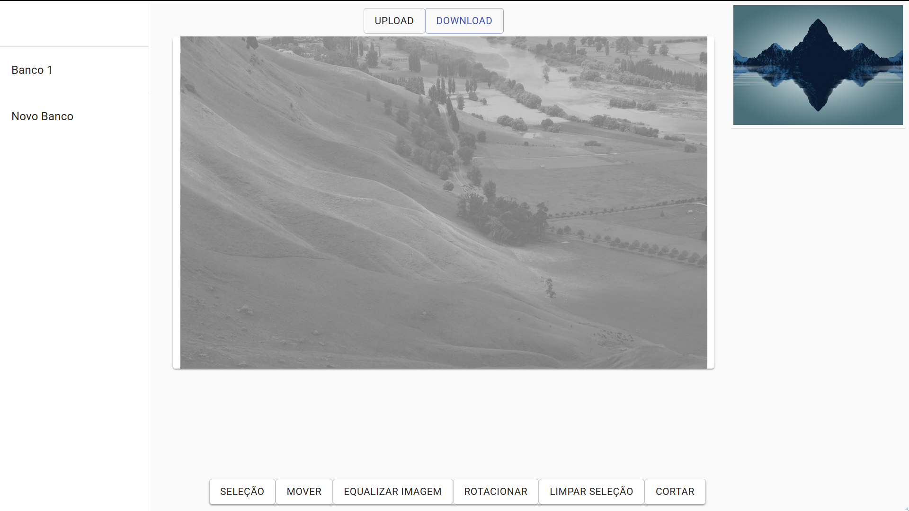
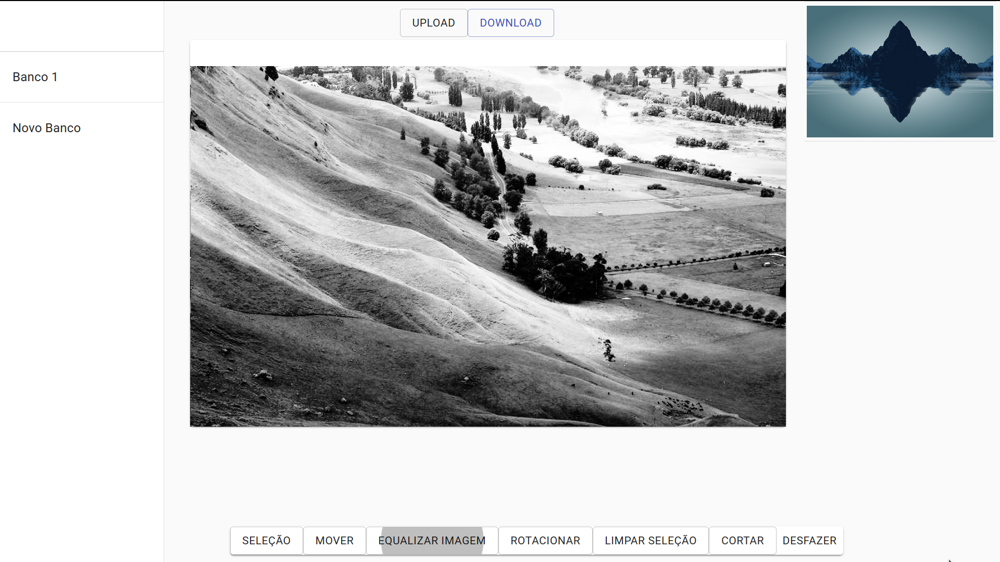
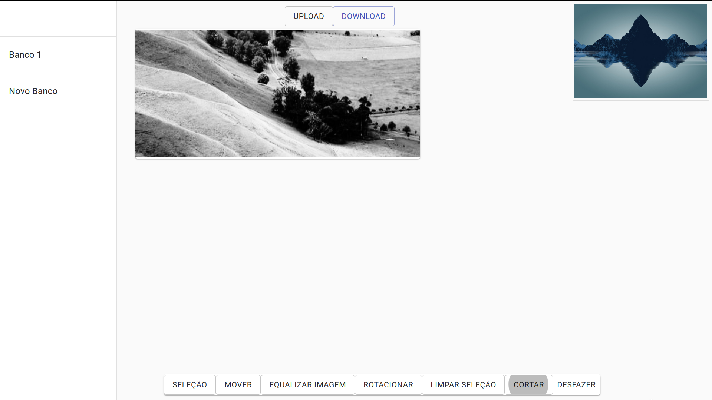

# React image editor


Image editor made in react.

### ✨ [Demo](https://react-editor-lucs123.netlify.app/)

## Screenshots
- ##### Histogram Equalization
 

 
- ##### Crop


## Dependencies
 - React.js
 - Open.cv
 - Material UI
 - Cropper.js

## Install
```sh
npm install
```

## Usage
Start live version:
```
npm start
```
Make Production build
```sh
npm run build
```

## Author

👤 **Lucas Ferreira**

* Website: https://lucs123.github.io

## Show your support

Give a ⭐️ if this project helped you!
